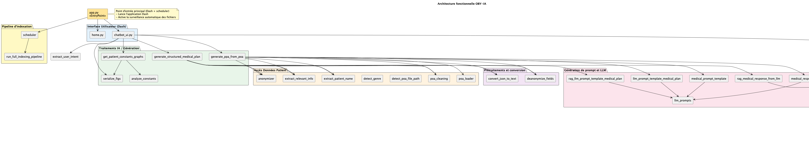

# 🏗️ Architecture Fonctionnelle de OBY-IA

L’application **OBY-IA** est un module intelligent intégré à l'application principale OBY. Elle permet d’analyser automatiquement les plans d’aide (POA), de générer des **Plans Personnalisés d’Accompagnement (PPA)**, d’analyser les **constantes médicales** des patients, et de formuler des **recommandations documentées** via un **agent conversationnel interactif**.

## ⚙️ Composants principaux

L’architecture repose sur les briques suivantes :

- 🎛️ Une **interface Dash** pilotée par `app.py` : elle orchestre l’ensemble, gère l’authentification, l'affichage, et les interactions utilisateur.
- 🧠 Un **agent conversationnel** : il comprend les intentions, extrait les informations clés, et active les traitements nécessaires (PPA, constantes, RAG…).
- 🧾 Des **modules de traitement POA** : chargés de nettoyer, anonymiser, structurer et analyser les fichiers patients.
- 📊 Des **modules d’analyse de constantes** : extraction depuis SQLite, transformation, détection d’anomalies, et génération de graphiques.
- 📚 Un **moteur RAG** (ChromaDB + LangChain) : enrichit les réponses à partir de documents internes (POA) ou web (sites HAS, CNSA…).
- 👁️ Un **scheduler Watchdog** : surveille automatiquement les fichiers et déclenche l’indexation des nouveaux documents santé.

---

## 📌 Schéma fonctionnel (PlantUML)

---

## 📂 Fichiers clés par bloc fonctionnel

### 🎛️ Interface Utilisateur (Dash)
- `app.py` : point d’entrée principal (Dash + scheduler)
- `home.py` : interface de connexion
- `chatbot_ui.py` : interface du chatbot et export des résultats

### 🧠 Agent & LLM
- `chatbot_ui.py` : déclencheur de toutes les chaînes LLM
- `extract_user_intent.py` : détection des intentions utilisateur
- `llm_prompts.py` : gestion des prompts système et utilisateur
- `llm_user_session/session_manager.py` : gestion des sessions, exports Markdown
- `llm_prompt_template_medical_plan()` : construction des prompts structurés
- `medical_response_from_llm()` / `rag_medical_response_from_llm()` : génération des réponses LLM (avec ou sans RAG)

### 🧾 Traitement POA et génération PPA
- `generate_ppa_from_poa.py` : chaîne complète d’analyse POA → génération du PPA
- `generate_structured_medical_plan.py` : génération d’un plan structuré enrichi par RAG
- `poa_loader.py` : chargement des fichiers patient
- `poa_cleaning.py` : nettoyage du texte
- `anonymizer.py` / `deanonymize_fields()` : anonymisation et réidentification
- `convert_json_to_text.py` : conversion JSON → texte utilisable par le LLM
- `extract_patient_name.py` : extraction du nom du patient via LLM
- `extract_relevant_info.py` : localisation automatique du fichier patient
- `detect_poa_file_path.py` / `detect_genre.py` : localisation et détection de genre

### 📊 Analyse des constantes
- `get_patient_constants_graphs.py` : fonction `process_patient_request_with_constants(nom)`
- `analyze_constants.py` : détection d’anomalies
- `serialize_figs.py` : sérialisation graphique pour l’export

### 📚 RAG & Recherche documentaire
- `retrieve_relevant_chunks.py` : récupération de passages depuis ChromaDB
- `rag_llm_prompt_template_medical_plan()` : génération de prompts enrichis
- `index_documents_chromadb.py` : injection des documents dans ChromaDB
- `scrape_trusted_sites.py` : extraction de données santé depuis le web
- `auto_index_documents.py` / `indexed_health_related_files.py` : suivi des fichiers indexés
- `run_full_indexing_pipeline.py` : pipeline complet DOCX + web
- `scheduler.py` : surveillance automatique via Watchdog

### 💾 Exports & Session utilisateur
- `export_chat_response.py` : export Markdown du dialogue + graphiques
- `llm_user_session/model.py` : modèle d’historique de session
- `llm_user_session/session_manager.py` : gestion mémoire par session utilisateur

---

## 🚀 Flux général

1. L’utilisateur se connecte via l’interface Dash (`home.py`)
2. Le chatbot analyse sa demande (`chatbot_ui.py`)
3. Le nom du patient et l’intention sont extraits (`extract_patient_name_llm`, `extract_user_intent`)
4. Selon l’intention, un pipeline spécifique est exécuté :
   - 🔎 Génération d’un PPA personnalisé
   - 📈 Analyse de constantes
   - 📚 Génération d’un plan structuré avec recommandations de soins, conduite à tenir face à un évènement, etc...
5. Les résultats (l'ensemble de l'historique du chat pour un patient donné) sont affichés à l’écran et peuvent être exportés (`export_chat_response.py`)
6. L'interaction entre l'utilisateur et OBY-Chat est conditionné par l'obtention d'une session par l'utilisateur.
   - L'obtention d'une session est, elle, conditionnée par un couple "user_id"-"password" valable.
   - Si l'utilisateur s'intéresse à un nouveau patient, l'ensemble de l'historique lié au patient précédent est effacé.

---

## 🔗 Liens utiles

- [Documentation technique des modules](./codebase/tools.md)
- [Guide de l’agent conversationnel](./codebase/agent.md)
- [Page d’accueil de la documentation](./index.md)

---
## Schéma fonctionnel de l'application OBY-IA
