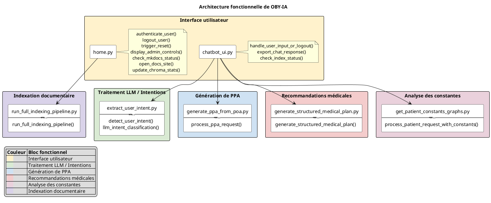

# 🧭 Vue d'ensemble des modules du projet OBY-Chat

_Cette page fournit une description concise des principaux modules Python du projet._

---

## 📄 Module : `data.constant_generator`

> **Rôle :**
> Module de génération de données fictives pour les constantes médicales.
> Ce module permet de créer une base SQLite contenant des données simulées pour plusieurs types
> de constantes de santé : poids, tension artérielle, fréquence cardiaque et température.
> Les données sont générées automatiquement pour un ensemble de patients fictifs,
> sur une période de 16 semaines, afin de servir de base de tests dans l'application OBY-IA.

---

## 📄 Module : `data.get_constants`

> **Rôle :**
> Module d'accès aux constantes médicales des patients depuis la base SQLite.
> Ce module permet :
> - d’identifier les constantes disponibles en base (poids, tension, etc.),
> - de récupérer l’historique des valeurs d’un patient pour chaque constante.
> Les données extraites sont retournées sous forme de DataFrames Pandas,
> prêtes à être analysées ou visualisées dans l'application OBY-IA.

---

## 📄 Module : `func.anonymizer`

> **Rôle :**
> Ce module permet :
> - d'anonymiser des champs sensibles dans une structure JSON (ex. : prénoms, adresses, contacts),
> - de générer un dictionnaire de correspondance entre valeurs originales et anonymisées,
> - de désanonymiser un texte produit à partir des données en réinjectant les valeurs originales.
> 
> L’anonymisation repose à la fois sur des règles dynamiques (ex. : prénom selon le sexe)
> et sur des valeurs codées en dur (HARDCODED_VALUES).

---

## 📄 Module : `func.auto_index_documents`

> **Rôle :**
> Module de déclenchement automatique de l'indexation documentaire.
> 
> Vérifie les modifications dans les fichiers DOCX et les pages web médicales,
> et lance l'indexation via ChromaDB uniquement si des changements sont détectés.

---

## 📄 Module : `func.detect_genre`

> **Rôle :**
> Module de génération de prénoms anonymisés à partir du sexe renseigné.
> 
> Ce module permet de produire des prénoms fictifs cohérents avec le sexe (masculin, féminin ou inconnu)
> dans le cadre d’un processus d’anonymisation de données personnelles.
> Il inclut également des valeurs codées en dur pour compléter des structures anonymisées.

---

## 📄 Module : `func.detect_poa_file_path`

> **Rôle :**
> Module de détection du chemin du fichier patient.
> 
> Ce module fournit une fonction pour localiser automatiquement un fichier contenant les données
> d’un patient, à partir de son nom, dans le dossier `src/data/poa_patients`.

---

## 📄 Module : `func.extract_patient_name`

> **Rôle :**
> Module pour l'extraction du nom du patient à partir d'une requête utilisateur.
> 
> Ce module utilise un LLM pour analyser une phrase en langage naturel
> et en extraire uniquement le nom de famille du patient mentionné.

---

## 📄 Module : `func.extract_user_intent`

> **Rôle :**
> Module extract_user_intent
> 
> Ce module permet de détecter l’intention principale d’un utilisateur à partir de sa requête textuelle.
> La détection repose d’abord sur des correspondances par mots-clés, puis bascule sur un modèle de langage
> (LLM) si aucune correspondance directe n’est trouvée.
> 
> Modifications apportées :
> - Ajout d’une hiérarchie de priorité dans la détection par mots-clés pour résoudre les ambiguïtés.
> - Ajout de docstrings conformes à la PEP 257.
> - Refactorisation avec étapes explicites et commentaires clairs.

---

## 📄 Module : `func.generate_ppa_from_poa`

> **Rôle :**
> Module de génération de PPA (Plan Personnalisé d’Accompagnement) à partir d’un document POA.
> 
> Ce module extrait le nom du patient depuis la requête utilisateur, charge et nettoie le document POA
> correspondant, anonymise les données, formate le contenu pour le modèle LLM, puis génère un PPA structuré.

---

## 📄 Module : `func.generate_structured_medical_plan`

> **Rôle :**
> Module de génération d’un plan d’action structuré à partir du POA d’un patient.
> 
> Ce module est déclenché lorsque l’intention « generate_recommendations » est détectée.
> Il extrait le nom du patient, charge et nettoie le document POA, anonymise les données,
> puis interroge un modèle LLM avec un prompt enrichi pour générer des recommandations classées
> (par type d'action : prévention, soins, traitements, etc.).

---

## 📄 Module : `func.get_chroma_stats`

> **Rôle :**
> Statistiques sur les données indexées dans ChromaDB et les fichiers JSON préparés.
> 
>     Returns:
>         dict: {
>             "docx_files": int,        # Fichiers uniques indexés depuis docx
>             "web_files": int,         # Fichiers uniques indexés depuis web
>             "docx_chunks": int,
>             "web_chunks": int,
>             "docx_json_files": int,   # Fichiers JSON générés depuis les DOCX
>             "web_json_files": int     # Fichiers JSON générés depuis le web
>         }

---

## 📄 Module : `func.get_patient_constants_graphs`

> **Rôle :**
> Module d'analyse et de visualisation des constantes médicales des patients.
> 
> Ce module permet :
> - de convertir les constantes brutes issues de la base de données en DataFrame,
> - de détecter des anomalies selon des seuils définis,
> - de générer des graphiques Plotly (poids, tension, température...),
> - de produire des tableaux HTML interactifs pour Dash,
> - de centraliser le traitement dans une fonction complète pour l’interface.
> 
> Utilisé notamment dans la page chatbot_ui de l’application OBY-IA.

---

## 📄 Module : `func.index_documents_chromadb`

> **Rôle :**
> Module d'indexation des documents de santé dans une base vectorielle ChromaDB.
> 
> Ce module prend en entrée des fichiers JSON représentant soit des documents issus de fichiers DOCX,
> soit des pages web structurées, puis les segmente et les insère dans une collection ChromaDB.

---

## 📄 Module : `func.indexed_health_related_files`

> **Rôle :**
> Module de suivi et de détection des changements dans les fichiers de santé.
> 
> Il permet de :
> - Calculer le hash des fichiers (DOCX, JSON, Python) pour en détecter les modifications.
> - Comparer l’état actuel à un journal enregistré.
> - Déterminer quels fichiers nécessitent une réindexation.

---

## 📄 Module : `func.llm_prompts`

> **Rôle :**
> Module de génération de prompts pour produire des Plans Personnalisés d’Accompagnement (PPA) ou des recommandations médicales,
> à partir du POA d’un patient et d’une requête utilisateur. Intègre également la version RAG avec enrichissement par des documents issus de ChromaDB.

---

## 📄 Module : `func.poa_cleaning`

> **Rôle :**
> Module de nettoyage des documents POA (Plan d’Objectifs et d’Actions).
> 
> Ce module filtre les champs non informatifs ou vides dans les fichiers JSON représentant
> les données patients, afin de faciliter leur traitement en aval.

---

## 📄 Module : `func.poa_loader`

> **Rôle :**
> Module de chargement des fichiers POA (Plan d’Objectifs et d’Actions) au format JSON.
> Ce module permet de localiser et lire un fichier patient stocké dans le dossier `data/poa_patients/`.

---

## 📄 Module : `func.retrieve_relevant_chunks`

> **Rôle :**
> Module de récupération des extraits pertinents depuis une base ChromaDB.
> Ce module interroge une collection vectorielle Chroma (via LangChain)
> et retourne les passages les plus similaires à une requête, pour enrichir un prompt.

---

## 📄 Module : `func.run_full_indexing_pipeline`

> **Rôle :**
> Module principal pour exécuter le pipeline complet d’indexation documentaire.
> Ce pipeline détecte les fichiers DOCX et les pages web modifiés, les convertit en JSON,
> et les indexe dans ChromaDB via LangChain. Il peut être lancé automatiquement
> (avec un scheduler) ou manuellement.

---

## 📄 Module : `func.scrape_trusted_sites`

> **Rôle :**
> Module de scraping des sites web de confiance en santé.
> 
> Ce module permet :
> - de charger dynamiquement la liste des sites référencés,
> - d’extraire les liens utiles à partir de pages de départ,
> - de structurer le contenu HTML pertinent (titres, paragraphes, listes),
> - et de sauvegarder les pages web sous forme de fichiers JSON pour indexation.
> Utilisé pour alimenter une base documentaire de recommandations en santé.

---

## 📄 Module : `func.serialize_figs`

> **Rôle :**
> Module de sérialisation et désérialisation de graphiques Plotly.
> Permet d’encoder les objets graphiques en base64 pour stockage ou transmission,
> et de les décoder pour affichage ultérieur dans l'application.

---

## 📄 Module : `utils.chroma_client`

> **Rôle :**
> Module d’accès centralisé au client ChromaDB pour l'application OBY-IA.
> Ce module fournit une fonction utilitaire permettant d’instancier un client ChromaDB
> persistant, configuré pour enregistrer les données dans le répertoire défini par
> `CHROMA_GLOBAL_DIR`. Il garantit qu’une seule instance client est utilisée
> grâce au décorateur `lru_cache`.
> Utilisé dans l'ensemble du projet pour interagir avec la base Chroma.

---

## 📄 Module : `utils.convert_fiches_docx_to_json`

> **Rôle :**
> Module de conversion de fiches documentaires DOCX en fichiers JSON exploitables.
> 
> Ce module permet d’extraire le contenu textuel structuré de fichiers Word (.docx)
> présents dans un répertoire donné, et de les convertir en dictionnaires JSON.
> Ces JSON sont ensuite utilisés dans l’application OBY-IA pour l’indexation
> et la recherche sémantique de recommandations.
> 
> Fonctionnalités :
> - Lecture et traitement de fichiers `.docx`.
> - Nettoyage et normalisation du contenu.
> - Export en fichiers `.json` avec le même nom de base.

---

## 📄 Module : `utils.convert_json_text`

> **Rôle :**
> Module de conversion des données JSON d'un POA en texte structuré pour LLM.
> 
> Ce module extrait les informations pertinentes du dictionnaire JSON d’un plan
> d’objectifs et d’actions (POA), notamment les données de la personne accompagnée,
> ses contacts et les différentes sections thématiques (social, santé, autonomie).
> Il génère un texte lisible destiné à être injecté dans un prompt pour un modèle LLM.
> 
> Utilisé pour formater proprement les données en amont d’une génération automatique
> de synthèse ou de recommandations.

---

## 📄 Module : `utils.export_chat_response`

> **Rôle :**
> Module d'export des réponses générées par le modèle LLM pour un patient donné.
> 
> Ce module permet de récupérer toutes les réponses associées à une session,
> de les concaténer proprement, et de les exporter dans un fichier Markdown.
> Il peut également intégrer des graphiques de constantes si fournis.
> 
> Utilisé notamment pour générer des synthèses textuelles enrichies à partir
> des sessions de chat dans l'application OBY-IA.

---

## 📄 Module : `utils.reset_data`

> **Rôle :**
> Module de réinitialisation des données indexées de l'application OBY-IA.
> Ce module fournit une fonction utilitaire permettant de nettoyer l’environnement
> de travail en supprimant :
> - les collections ChromaDB (ex. : `base_docx`, `base_web`),
> - les fichiers JSON issus de l’extraction documentaire locale et web,
> - le fichier journal qui suit les fichiers déjà indexés.
> Utile pour remettre à zéro l’état de l’index avant un nouveau traitement complet.

---

## 📄 Module : `utils.scheduler`

> **Rôle :**
> Module de surveillance des fichiers pour l'indexation automatique.
> 
> Ce module utilise Watchdog pour observer les répertoires contenant des documents à indexer
> (docx, données web, versions de plans). Lorsqu’un changement est détecté, le pipeline
> d’indexation complet est automatiquement relancé pour mettre à jour les bases vectorielles.
> 
> Fonctions :
> - start_scheduler : Démarre la surveillance continue via Watchdog.
> 
> Classes :
> - IndexingEventHandler : Handler personnalisé déclenchant l’indexation à chaque événement.

---

## 📄 Module : `utils.vector_db_utils`

> **Rôle :**
> Module utilitaire pour la gestion de l'état de l'indexation ChromaDB.
> Ce module contient des fonctions permettant de :
> - Vérifier si l'indexation ChromaDB est terminée (via un fichier flag).
> - Créer ou supprimer ce flag selon les besoins.
> Ce mécanisme permet à l'application (ex. interface Dash) de savoir si les bases
> vectorielles sont prêtes à être interrogées par les utilisateurs.

---

## 📄 Module : `llm_user_session.model`

> **Rôle :**
> Initialisation des modèles de langage utilisés dans l'application OBY-IA.
> Ce module charge les clés API depuis le fichier `.env` et instancie un modèle
> de langage compatible avec LangChain, en fonction de la configuration disponible.
> Actuellement :
> - Le modèle `ChatOpenAI` (GPT-4.1) est utilisé par défaut, en raison de la limitation
>   de tokens rencontrée avec Mistral lors du traitement de documents volumineux.
> - Le modèle `ChatMistralAI` reste présent en commentaire à des fins de test ou migration future.
> Variables :
>     llm_model : Instance unique du modèle LLM utilisé pour répondre aux requêtes utilisateur.

---

## 📄 Module : `llm_user_session.session_manager`

> **Rôle :**
> Gestion centralisée des sessions utilisateurs pour l'application OBY-IA.
> Ce module définit deux classes principales :
> - `Session` : Représente une session utilisateur, incluant l’historique des échanges entre
>   l’utilisateur et le modèle LLM (chat_history).
> - `SessionManager` : Gère les sessions actives à l’aide d’un dictionnaire indexé par `session_id`.
>   Il permet de :
>     - créer, récupérer et supprimer des sessions,
>     - suivre le patient actuellement traité dans une session,
>     - stocker et réinitialiser un dictionnaire de correspondance pour l’anonymisation des données,
>     - enregistrer et restituer les réponses générées par le LLM pour les réutiliser (ex. : génération de documents PDF).
> Ce gestionnaire est conçu pour un usage multi-utilisateur avec une mémoire indépendante par session.

---

## 📄 Module : `llm_user_session.session_manager_instance`

> **Rôle :**
> Initialisation de l'instance unique du gestionnaire de sessions utilisateur.
> 
> Ce module importe la classe `SessionManager` et instancie un objet unique
> `session_manager_instance` utilisé pour gérer les sessions utilisateur
> dans l'application OBY-IA.
> 
> Cette instance centralisée permet de partager la gestion des sessions entre
> différents modules sans créer plusieurs objets SessionManager.

---

## 📄 Module : `pages.chatbot_ui`

> **Rôle :**
> Interface utilisateur du chatbot OBY-IA (page Dash `/chatbot`).
> Ce module définit l’interface graphique de la page chatbot de l’application OBY-IA.
> Il gère :
> - l’affichage des constantes médicales du patient (graphique, tableau, anomalies),
> - la détection de l’intention utilisateur à partir d’une saisie libre,
> - la génération automatique de contenu (PPA, plan de soins, recommandations),
> - l’enregistrement et l’affichage de l’historique des échanges avec le LLM,
> - l’export de la session au format Markdown,
> - l’affichage des détails dans une fenêtre modale.
> Ce module repose sur Dash, Dash Bootstrap Components et une logique centralisée via `session_manager_instance`.

---

## 📄 Module : `pages.home`

> **Rôle :**
> Page d'accueil et d'authentification de l'application OBY-IA.
> 
> Ce module Dash permet :
> - l'authentification des utilisateurs via un identifiant et un mot de passe,
> - la gestion des sessions (création, suppression),
> - l'accès conditionnel aux fonctions d'administration (comme la réinitialisation des bases de données),
> - l'affichage dynamique de l'interface en fonction du rôle de l'utilisateur (admin ou utilisateur classique).
> 
> La session est stockée via `dcc.Store`, et la sécurité repose sur `session_manager_instance`.

---

## 📄 Module : `app`

> **Rôle :**
> Module principal de l'application OBY-IA.
> Ce module initialise l'application Dash, configure la navigation entre les pages,
> et vérifie la disponibilité de la base de données des constantes médicales.
> Fonctionnalités principales :
> - Chargement des variables d'environnement depuis un fichier `.env` à la racine.
> - Vérification et génération automatique de la base SQLite (`constantes_sante.db`).
> - Initialisation de l'application Dash avec gestion des pages (`use_pages=True`).
> - Mise en place d'une barre de navigation et d'un conteneur de pages dynamiques.
> - Démarrage d'un planificateur de tâches (scheduler) dans un thread dédié au lancement.
> Ce fichier doit être exécuté pour lancer le serveur Dash : `python -m src.app`

---

"""
# 🧠 Architecture fonctionnelle de OBY-IA

Ce schéma présente l'organisation des modules techniques d'OBY-IA.

