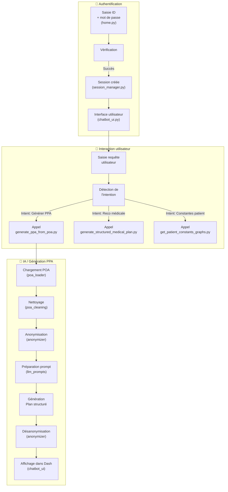

# OBY-IA

Bienvenue dans la documentation du module d’intelligence artificielle intégré à l’application OBY.

## Objectif du projet

Le module **OBY-IA** est une brique d'intelligence artificielle embarquée dans l'application métier **OBY**, dédiée à l'accompagnement des personnes âgées à domicile.

Il a pour but de générer automatiquement des **Plans Personnalisés d’Accompagnement (PPA)** à partir de documents d’évaluation appelés **Plans d’Objectifs et d’Actions (POA)**. Il permet également d’assister les professionnels dans la prise de décision, l'analyse de données de santé et la planification des actions de soin.

---

## Fonctionnalités principales

- 💬 Interaction via un **chatbot intégré** à l’interface Dash de l’application.
- 📄 Anonymisation des valeurs liées au patient (nom, adresse, ...).
- 📄 Gestion multi sessions.
- 🔍 Analyse automatisée des documents **POA** (chargement, nettoyage, structuration).
- 🧠 Génération de **Plan Personnalisés d'Accompagnement** à l’aide d’un modèle de langage (LLM).
- 🧠 En rapport avec un contexte patient, génération de **recommandations médicales enrichies** via la recherche documentaire (RAG).
- 📈 Affichage des constantes d'un patient sous forme de graphes et de tables.
- 📈 Détection de **constantes vitales anormales**.
- 📄 Export des interactions utilisateur-OBY-IA en format Markdown.

---

## 🧠 Schéma fonctionnel d'OBY-IA

Ce schéma présente l'exemple d'un flux de génération de PPA.

