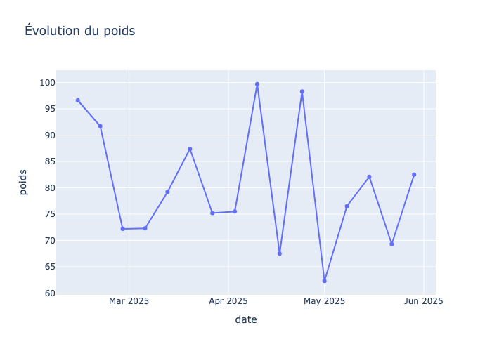
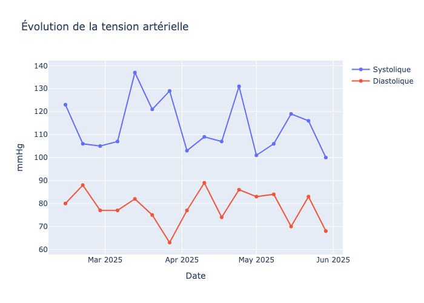
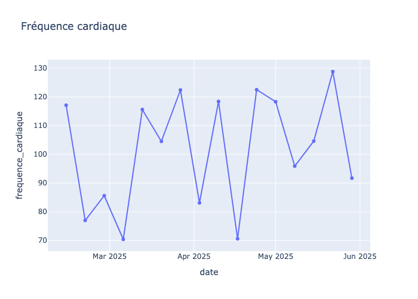
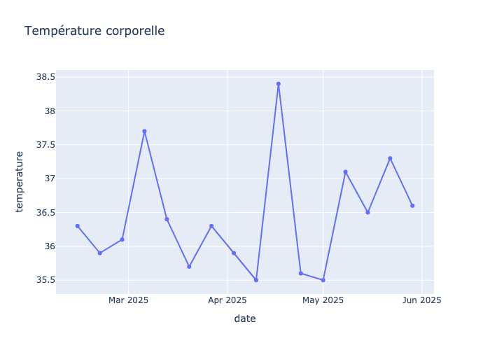

Projet Personnalisé d’Accompagnement (PPA) du patient Deloin

---

## I - **Présentation de la personne accompagnée**
### 1 - **Identification**
- Nom : Deloin
- Prénom : Alain
- Date de naissance : Non renseigné
- Âge : 79 ans
- Adresse : Non renseigné
- Situation familiale : Marié, vit avec son épouse (personne autonome)
- Téléphone : Non renseigné
- Courriel : Non renseigné

### 2 - **Situation médicale et sociale**
- Sortie récente d’hospitalisation après un accident vasculaire cérébral (AVC) survenu le mois précédent.
- Perte d’autonomie quasi complète de l’hémicorps gauche.
- Séjour de 45 jours en aigu puis en SSR.
- Porte un pacemaker (posé en février 2025).
- Légère baisse des prises alimentaires, état de dénutrition avérée (MNA 7/14), IMC 25,4 (surpoids).
- Régime médicalement prescrit (type non renseigné).
- Constipation chronique, port de protection la nuit.
- Déficit moteur gauche, appui instable, ne peut se lever sans aide.
- Douleurs à l’épaule et au bras paralysé (intensité 5/10, occasionnelles lors de la mobilisation).
- Anxiété significative (test GAI positif), pas de syndrome dépressif majeur (mini-GDS 1/4).
- Aphasie d’origine vasculaire.
- Polymédication (>5 médicaments/jour), prise d’antidépresseur et d’anticoagulant.
- Vit en logement urbain >100 m², RDC, chambre non équipée pour l’autonomie actuelle.
- Absence de barres d’appui et de siège de douche, WC trop bas, couloirs peu lumineux.
- Bus à 300 m, commerces non accessibles à moins de 10 min à pied.

### 3 - **Besoins, attentes et objectifs**
- Maintenir ou améliorer l’état de santé et l’autonomie.
- Prévenir une nouvelle hospitalisation.
- Adapter le logement à la perte d’autonomie.
- Sécuriser les transferts, l’hygiène, l’élimination et la mobilité.
- Soutenir l’épouse et prévenir l’épuisement de l’aidant.
- Prévenir le risque d’escarre.
- Suivi nutritionnel et médical renforcé.

### 4 - **Évaluation de l’autonomie (grille AGGIR)**
- Groupe Iso-Ressources (GIR) : 4
- Autonomie moyenne pour les activités corporelles, bonne pour les activités mentales.
- Autonomie bonne pour les activités domestiques, mauvaise pour les activités sociales.
- Aide totale nécessaire pour : transferts, déplacements intérieurs, toilette, élimination, habillage, alimentation (se servir), déplacements extérieurs, activités de temps libre, achats.
- Aide partielle pour : gestion des médicaments, habillage haut, achats.
- Autonomie pour : gestion du budget, orientation, cohérence, communication (avec incitation/surveillance pour le comportement).

### 5 - **Difficultés dans la vie quotidienne**
- Mobilité très réduite, besoin d’aide pour tous les transferts et déplacements.
- Difficultés majeures pour la toilette, l’habillage, l’élimination.
- Risque de chute élevé, appui instable.
- Difficultés d’accès et d’utilisation des sanitaires et de la salle de bain.
- Difficultés pour la gestion des repas (légère baisse alimentaire, dénutrition).
- Douleurs lors de la mobilisation.
- Isolement social relatif, activités extérieures limitées depuis l’AVC.
- Risque d’escarre modéré (Norton 13).
- Anxiété significative.

---

## II - **Projet de vie de la personne**
### 1 - **Aspirations et souhaits**
- Rester à domicile dans un environnement sécurisé et adapté.
- Maintenir un maximum d’autonomie dans les gestes quotidiens.
- Continuer à vivre avec son épouse.
- Préserver la qualité de vie et le lien social autant que possible.

### 2 - **Priorités fixées**
- Sécurisation du logement et adaptation des équipements.
- Mise en place d’aides humaines et techniques adaptées.
- Soutien à l’épouse aidante.
- Prévention des complications (chutes, escarres, dénutrition).
- Suivi médical et paramédical rapproché.

---

## III - **Objectifs d’accompagnement**
### 1 - **Objectifs généraux et spécifiques**
- Maintenir ou améliorer l’autonomie fonctionnelle.
- Prévenir les risques de chute et d’escarre.
- Adapter le logement pour sécuriser les déplacements et l’hygiène.
- Assurer un suivi nutritionnel et médical régulier.
- Soutenir l’aidant principal (épouse).
- Prévenir l’isolement social et favoriser la participation à des activités adaptées.
- Mettre en place un plan d’aide humain et technique individualisé.
- Prévenir une nouvelle hospitalisation.
- Améliorer la gestion de la douleur et de l’anxiété.

---

## IV - **Actions et moyens mis en œuvre**
### 1 - **Services et prestations mobilisés**

#### Semaine 1.

| Heure        | Lundi                                   | Mardi                                   | Mercredi                                | Jeudi                                   | Vendredi                                | Samedi                                  | Dimanche                                |
|:-------------|:----------------------------------------|:----------------------------------------|:----------------------------------------|:----------------------------------------|:----------------------------------------|:----------------------------------------|:----------------------------------------|
| 8h00-9h30    | aide au lever, toilette partielle, habillage, transfert, installation fauteuil roulant | aide au lever, toilette partielle, habillage, transfert, installation fauteuil roulant | aide au lever, toilette partielle, habillage, transfert, installation fauteuil roulant | aide au lever, toilette partielle, habillage, transfert, installation fauteuil roulant | aide au lever, toilette partielle, habillage, transfert, installation fauteuil roulant | aide au lever, toilette partielle, habillage, transfert, installation fauteuil roulant | aide au lever, toilette partielle, habillage, transfert, installation fauteuil roulant |
| 10h00-11h00  | change, élimination, stimulation, surveillance cutanée | change, élimination, stimulation, surveillance cutanée | change, élimination, stimulation, surveillance cutanée | change, élimination, stimulation, surveillance cutanée | change, élimination, stimulation, surveillance cutanée | change, élimination, stimulation, surveillance cutanée | change, élimination, stimulation, surveillance cutanée |
| 12h00-13h00  | aide à la préparation repas, installation, surveillance prise alimentaire | aide à la préparation repas, installation, surveillance prise alimentaire | aide à la préparation repas, installation, surveillance prise alimentaire | aide à la préparation repas, installation, surveillance prise alimentaire | aide à la préparation repas, installation, surveillance prise alimentaire | aide à la préparation repas, installation, surveillance prise alimentaire | aide à la préparation repas, installation, surveillance prise alimentaire |
| 14h00-15h30  | aide à la mobilité, stimulation, accompagnement activité adaptée | aide à la mobilité, stimulation, accompagnement activité adaptée | aide à la mobilité, stimulation, accompagnement activité adaptée | aide à la mobilité, stimulation, accompagnement activité adaptée | aide à la mobilité, stimulation, accompagnement activité adaptée | aide à la mobilité, stimulation, accompagnement activité adaptée | aide à la mobilité, stimulation, accompagnement activité adaptée |
| 16h00-17h00  | aide à l’élimination, change, surveillance hydratation | aide à l’élimination, change, surveillance hydratation | aide à l’élimination, change, surveillance hydratation | aide à l’élimination, change, surveillance hydratation | aide à l’élimination, change, surveillance hydratation | aide à l’élimination, change, surveillance hydratation | aide à l’élimination, change, surveillance hydratation |
| 18h00-19h30  | aide au repas, installation, surveillance prise alimentaire | aide au repas, installation, surveillance prise alimentaire | aide au repas, installation, surveillance prise alimentaire | aide au repas, installation, surveillance prise alimentaire | aide au repas, installation, surveillance prise alimentaire | aide au repas, installation, surveillance prise alimentaire | aide au repas, installation, surveillance prise alimentaire |
| 20h00-21h00  | aide au coucher, change, installation lit médicalisé, surveillance | aide au coucher, change, installation lit médicalisé, surveillance | aide au coucher, change, installation lit médicalisé, surveillance | aide au coucher, change, installation lit médicalisé, surveillance | aide au coucher, change, installation lit médicalisé, surveillance | aide au coucher, change, installation lit médicalisé, surveillance | aide au coucher, change, installation lit médicalisé, surveillance |
| nuit         | surveillance, change si besoin, prévention escarres | surveillance, change si besoin, prévention escarres | surveillance, change si besoin, prévention escarres | surveillance, change si besoin, prévention escarres | surveillance, change si besoin, prévention escarres | surveillance, change si besoin, prévention escarres | surveillance, change si besoin, prévention escarres |

  
#### Semaine 2.

| Heure        | Lundi                                   | Mardi                                   | Mercredi                                | Jeudi                                   | Vendredi                                | Samedi                                  | Dimanche                                |
|:-------------|:----------------------------------------|:----------------------------------------|:----------------------------------------|:----------------------------------------|:----------------------------------------|:----------------------------------------|:----------------------------------------|
| 8h00-9h30    | aide au lever, toilette partielle, habillage, transfert, installation fauteuil roulant | aide au lever, toilette partielle, habillage, transfert, installation fauteuil roulant | aide au lever, toilette partielle, habillage, transfert, installation fauteuil roulant | aide au lever, toilette partielle, habillage, transfert, installation fauteuil roulant | aide au lever, toilette partielle, habillage, transfert, installation fauteuil roulant | aide au lever, toilette partielle, habillage, transfert, installation fauteuil roulant | aide au lever, toilette partielle, habillage, transfert, installation fauteuil roulant |
| 10h00-11h00  | change, élimination, stimulation, surveillance cutanée | change, élimination, stimulation, surveillance cutanée | change, élimination, stimulation, surveillance cutanée | change, élimination, stimulation, surveillance cutanée | change, élimination, stimulation, surveillance cutanée | change, élimination, stimulation, surveillance cutanée | change, élimination, stimulation, surveillance cutanée |
| 12h00-13h00  | aide à la préparation repas, installation, surveillance prise alimentaire | aide à la préparation repas, installation, surveillance prise alimentaire | aide à la préparation repas, installation, surveillance prise alimentaire | aide à la préparation repas, installation, surveillance prise alimentaire | aide à la préparation repas, installation, surveillance prise alimentaire | aide à la préparation repas, installation, surveillance prise alimentaire | aide à la préparation repas, installation, surveillance prise alimentaire |
| 14h00-15h30  | aide à la mobilité, stimulation, accompagnement activité adaptée | aide à la mobilité, stimulation, accompagnement activité adaptée | aide à la mobilité, stimulation, accompagnement activité adaptée | aide à la mobilité, stimulation, accompagnement activité adaptée | aide à la mobilité, stimulation, accompagnement activité adaptée | aide à la mobilité, stimulation, accompagnement activité adaptée | aide à la mobilité, stimulation, accompagnement activité adaptée |
| 16h00-17h00  | aide à l’élimination, change, surveillance hydratation | aide à l’élimination, change, surveillance hydratation | aide à l’élimination, change, surveillance hydratation | aide à l’élimination, change, surveillance hydratation | aide à l’élimination, change, surveillance hydratation | aide à l’élimination, change, surveillance hydratation | aide à l’élimination, change, surveillance hydratation |
| 18h00-19h30  | aide au repas, installation, surveillance prise alimentaire | aide au repas, installation, surveillance prise alimentaire | aide au repas, installation, surveillance prise alimentaire | aide au repas, installation, surveillance prise alimentaire | aide au repas, installation, surveillance prise alimentaire | aide au repas, installation, surveillance prise alimentaire | aide au repas, installation, surveillance prise alimentaire |
| 20h00-21h00  | aide au coucher, change, installation lit médicalisé, surveillance | aide au coucher, change, installation lit médicalisé, surveillance | aide au coucher, change, installation lit médicalisé, surveillance | aide au coucher, change, installation lit médicalisé, surveillance | aide au coucher, change, installation lit médicalisé, surveillance | aide au coucher, change, installation lit médicalisé, surveillance | aide au coucher, change, installation lit médicalisé, surveillance |
| nuit         | surveillance, change si besoin, prévention escarres | surveillance, change si besoin, prévention escarres | surveillance, change si besoin, prévention escarres | surveillance, change si besoin, prévention escarres | surveillance, change si besoin, prévention escarres | surveillance, change si besoin, prévention escarres | surveillance, change si besoin, prévention escarres |

---

### 2 - **Autres actions du PPA**

#### 1. Plan d'aide volet social.

| Problèmes | Objectifs partagés | Actions choisies | Intervenants en charge de l'action | Critères d'évaluation | Résultats |
|:------|:------|:------|:------|:------|:------|
| Isolement social, limitation des activités extérieures | Maintenir le lien social, prévenir l’isolement | Proposer des activités adaptées à domicile, soutien à l’épouse, information sur les droits des aidants | Responsable secteur SAAD, famille | Participation à des activités, satisfaction de la personne et de l’aidant | Non renseigné |
| Épuisement de l’aidant principal | Soutenir l’aidant, prévenir l’épuisement | Communication des numéros nationaux d’aide aux aidants, relais possible avec SSIAD | Responsable secteur SAAD | État de santé de l’aidant, recours à des relais | Non renseigné |

- 1. Soutien à l’aidant principal (épouse).
- 2. Prévention de l’isolement social.
- 3. Information sur les droits et relais pour les aidants.
- 4. Propositions d’activités adaptées à domicile.

  
#### 2. Plan d’aide volet sanitaire.

| Problèmes | Objectifs partagés | Actions choisies | Intervenants en charge de l'action | Critères d'évaluation | Résultats |
|:------|:------|:------|:------|:------|:------|
| Perte d’autonomie post-AVC, déficit moteur gauche | Maintenir l’autonomie, sécuriser les gestes quotidiens | Mise en place d’aides techniques (lit médicalisé, barres d’appui, fauteuil roulant), adaptation du logement | Responsable secteur SAAD, ergothérapeute, médecin traitant | Réalisation des adaptations, sécurité des déplacements | Non renseigné |
| Dénutrition, légère baisse alimentaire | Améliorer l’état nutritionnel | Suivi médical, pesée régulière, surveillance des prises alimentaires | Médecin traitant, aide à domicile | Stabilisation ou amélioration du poids, appétit | Non renseigné |
| Risque d’escarre | Prévenir les escarres | Surveillance cutanée, utilisation de coussin anti-escarre, changement de position | Aide à domicile, infirmier | Absence d’escarre, état cutané | Non renseigné |
| Douleurs à la mobilisation | Améliorer le confort, réduire la douleur | Surveillance, adaptation des gestes, consultation médicale si aggravation | Aide à domicile, médecin traitant | Intensité de la douleur, confort | Non renseigné |
| Anxiété significative | Réduire l’anxiété, améliorer le bien-être | Surveillance, orientation vers un soutien psychologique si besoin | Aide à domicile, médecin traitant | Niveau d’anxiété, recours à un soutien | Non renseigné |

- 1. Adaptation du logement et aides techniques.
- 2. Suivi nutritionnel et médical.
- 3. Prévention des escarres.
- 4. Gestion de la douleur et de l’anxiété.
- 5. Surveillance de l’état de santé général.

  
### 3 - **Professionnels impliqués**
- Responsable secteur SAAD
- Médecin traitant
- Ergothérapeute
- Infirmier(ère) SSIAD/IDEL
- Aide à domicile
- Famille (épouse)
- Électricien (pour adaptation du logement)
- Autres intervenants paramédicaux selon besoins (psychologue, diététicien…)

---

## V - **Modalités de suivi et d’évaluation**
### 1 - **Fréquence des évaluations**
- Évaluation initiale à la mise en place du plan d’aide.
- Réévaluation mensuelle par le responsable secteur SAAD.
- Suivi médical régulier (médecin traitant, infirmier).
- Surveillance quotidienne par l’aide à domicile.

### 2 - **Modalités de révision du projet**
- Révision du projet à chaque changement significatif de l’état de santé ou de l’autonomie.
- Réunion de coordination avec les professionnels impliqués en cas de besoin.
- Prise en compte des retours de la personne et de l’aidant principal.

### 3 - **Conditions de demande de modifications**
- Sur demande de la personne accompagnée ou de son entourage.
- Sur signalement d’un professionnel intervenant.
- En cas d’événement de santé ou de rupture de parcours.

---

## VI - **Bilan de l’accompagnement**
### 1 - **Évaluation continue des résultats**
- Suivi de l’évolution de l’autonomie et de la sécurité à domicile.
- Surveillance de l’état nutritionnel, cutané et psychologique.
- Évaluation de la satisfaction de la personne et de l’aidant.

### 2 - **Bilan annuel ou semestriel**
- Bilan semestriel formalisé avec l’ensemble des intervenants.
- Ajustement du plan d’aide selon l’évolution des besoins.
- Compte rendu transmis à la personne, à l’aidant et au médecin traitant.

---

## VII - **Participation de la personne et de son entourage**
- La personne est d’accord avec le plan d’aide proposé.
- L’épouse (aidant principal) est d’accord mais exprime le besoin d’un passage supplémentaire le soir.
- Implication active de l’épouse dans la gestion quotidienne et l’adaptation du logement.
- Prise en compte des souhaits et retours de la personne et de son entourage lors des révisions du plan.

---

## **Recommandations personnalisées**

1. **Renforcer la coordination entre les intervenants (SAAD, SSIAD, médecin traitant, ergothérapeute) pour anticiper toute évolution de l’état de santé et ajuster rapidement le plan d’aide.**
2. **Mettre en place un accompagnement psychologique ou un groupe de parole pour l’aidant principal afin de prévenir l’épuisement et favoriser le maintien à domicile.**
3. **Programmer une visite d’ergothérapeute pour finaliser l’adaptation du logement et former l’aidant aux gestes de prévention des chutes et des escarres.**

---

## Graphique des constantes du patient

