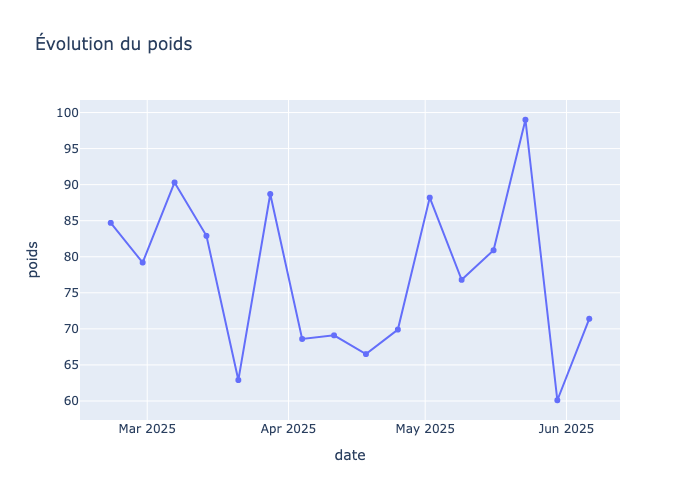
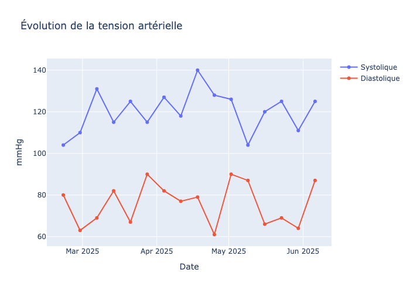
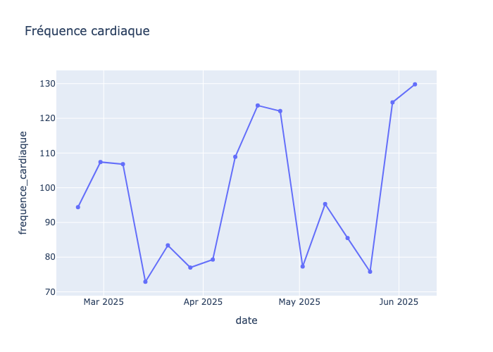
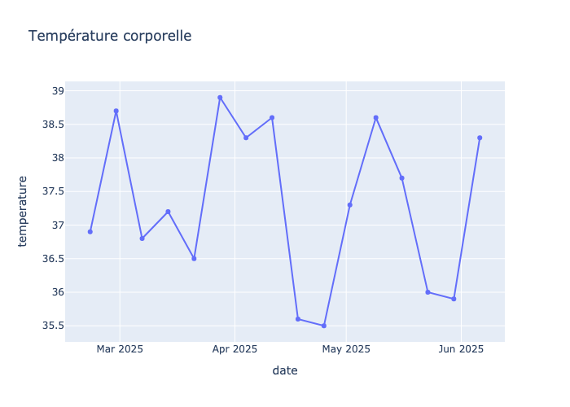

Plan Personnalisé d’Accompagnement du patient Deloin

## I - **Présentation de la personne accompagnée**
### 1 - **Identification**
- Nom : deloin
- Prénom : alain
- Sexe : Masculin
- Date de naissance : 1945-09-15
- Adresse : 12 avenue caffin, 94100 LA VARENNE SAINT HILAIRE
- Téléphone : 0625454121
- Courriel : alain.deloin@gmail.com

### 2 - **Situation médicale et sociale**
- 1. Dégradation récente de l’état de santé, hospitalisation récente.
- 2. Présence d’aidants dans l’entourage.
- 3. Surpoids (IMC : 25,4), état de dénutrition avérée (MNA : 7/14), légère baisse des prises alimentaires.
- 4. Troubles digestifs (gaz, flatulences), port de protections hygiéniques la nuit.
- 5. Déficit moteur à gauche (membre supérieur et inférieur, origine vasculaire), mobilité très ralentie ou impossible à la marche.
- 6. Risque modéré d’escarre (échelle de Norton).
- 7. Déficiences visuelle et auditive nécessitant une évaluation spécialisée.
- 8. Douleurs occasionnelles lors de la mobilisation (EVA : 5/10).
- 9. Anxiété, troubles mnésiques et cognitifs importants (Mini-Cog : 1/5), symptômes dépressifs (Mini-GDS : 1/4).
- 10. Polymédication (>5 médicaments), prise d’antidépresseur et d’anticoagulants.

### 3 - **Besoins, attentes et objectifs d’accompagnement**
- 1. Maintenir ou améliorer l’état de santé général.
- 2. Prévenir une nouvelle hospitalisation.
- 3. Adapter l’habitat et le matériel pour sécuriser la vie quotidienne.
- 4. Soutenir les aidants et prévenir leur épuisement.
- 5. Mettre en place un plan d’aide adapté.
- 6. Améliorer l’autonomie et la prévention des troubles musculo-squelettiques.
- 7. Maintenir l’hygiène intime et prévenir les complications cutanées.
- 8. Prendre en charge les troubles nutritionnels, moteurs, sensoriels, cognitifs et psychiques.

### 4 - **Évaluation de l’autonomie (grille AGGIR)**
- 1. Mobilité très ralentie ou impossible à la marche (test de marche : 16:55 secondes, 0/4 points).
- 2. Mobilité correcte au lever de chaise (12:51 secondes, 3/4 points).
- 3. Risque modéré d’escarre selon l’échelle de Norton.
- 4. Non renseigné pour le score AGGIR précis.

### 5 - **Difficultés dans la vie quotidienne**
- 1. Difficultés d’accès au logement (marches, nécessité d’une rampe d’accès).
- 2. Chambre non adaptée (besoin de lit médicalisé, désencombrement).
- 3. Salle de bain sans barres d’appui ni siège de douche.
- 4. WC trop bas, absence de barres de relevage.
- 5. Faible luminosité dans les couloirs.
- 6. Dépendance pour l’hygiène, l’élimination, la mobilité.
- 7. Troubles cognitifs et de l’humeur impactant l’autonomie.
- 8. Surveillance nécessaire pour la prise de médicaments et la gestion des risques.

---

## II - **Projet de vie de la personne**
### 1 - **Aspirations et souhaits**
- 1. Maintenir le plus possible l’autonomie à domicile.
- 2. Sécuriser l’environnement pour limiter les risques de chute et d’accident.
- 3. Prévenir l’épuisement des aidants.
- 4. Préserver la vie sociale et le lien avec l’entourage.

### 2 - **Priorités fixées**
- 1. Adapter rapidement l’habitat et le matériel.
- 2. Mettre en place un plan d’aide coordonné avec les professionnels de santé.
- 3. Soutenir les aidants et leur fournir des ressources.
- 4. Prévenir les complications médicales (escarres, dénutrition, chutes).

---

## III - **Objectifs d’accompagnement**
### 1 - **Objectifs généraux et spécifiques**
- 1. Améliorer ou maintenir l’état de santé général.
- 2. Prévenir une nouvelle hospitalisation.
- 3. Permettre une circulation et une déambulation aisée et sans risques dans le logement.
- 4. Sécuriser la toilette et l’hygiène.
- 5. Améliorer l’éclairage et l’accessibilité du domicile.
- 6. Mettre en place les aides techniques nécessaires (lit médicalisé, barres d’appui, fauteuil de douche, etc.).
- 7. Soutenir les aidants et prévenir leur épuisement.
- 8. Maintenir l’hygiène intime et prévenir les complications cutanées.
- 9. Prendre en charge les troubles nutritionnels, moteurs, sensoriels, cognitifs et psychiques.
- 10. Assurer une bonne observance thérapeutique et éviter les risques liés à la polymédication.

---

## IV - **Actions et moyens mis en œuvre**
### 1 - **Services et prestations mobilisés**
- 1. Intervention du SAAD (Service d’Aide et d’Accompagnement à Domicile) pour l’aide à la vie quotidienne.
- 2. Coordination avec le médecin traitant et les professionnels de santé.
- 3. Intervention d’un ergothérapeute pour l’adaptation du domicile.
- 4. Mise en place d’un lit médicalisé, barres d’appui, fauteuil de douche, potence de lit, réhausseur de WC.
- 5. Intervention d’un électricien pour améliorer l’éclairage.
- 6. Suivi nutritionnel (pesée régulière, surveillance des apports).
- 7. Surveillance de l’élimination et gestion des protections hygiéniques.
- 8. Surveillance de la mobilité, proposition d’activités adaptées (Tai Chi/Qi Qong).
- 9. Prise de rendez-vous chez ORL et ophtalmologue.
- 10. Prise en charge psychologique.
- 11. Surveillance de la douleur et de l’état cutané.
- 12. Soutien et information aux aidants (numéros nationaux d’aide).

---

**Semaine 1.**

| Heure        | Lundi                            | Mardi                            | Mercredi                         | Jeudi                            | Vendredi                         | Samedi                           | Dimanche                         |
|:-------------|:---------------------------------|:---------------------------------|:---------------------------------|:---------------------------------|:---------------------------------|:---------------------------------|:---------------------------------|
| 8h00-9h30    | aide au lever, toilette complète, pesée régulière | aide au lever, toilette complète, surveillance état cutané | aide au lever, toilette complète | aide au lever, toilette complète | aide au lever, toilette complète | aide au lever, toilette complète | aide au lever, toilette complète |
| 10h00-11h00  | surveillance élimination, changement protections, stimulation mobilité | surveillance élimination, changement protections | surveillance élimination, changement protections | surveillance élimination, changement protections | surveillance élimination, changement protections | surveillance élimination, changement protections | surveillance élimination, changement protections |
| 12h00-13h00  | aide à la prise de repas, surveillance nutrition | aide à la prise de repas, surveillance nutrition | aide à la prise de repas, surveillance nutrition | aide à la prise de repas, surveillance nutrition | aide à la prise de repas, surveillance nutrition | aide à la prise de repas, surveillance nutrition | aide à la prise de repas, surveillance nutrition |
| 14h00-15h30  | activité adaptée (Tai Chi/Qi Qong), surveillance douleur | activité adaptée, surveillance douleur | activité adaptée, surveillance douleur | activité adaptée, surveillance douleur | activité adaptée, surveillance douleur | activité adaptée, surveillance douleur | activité adaptée, surveillance douleur |
| 16h00-17h00  | surveillance état cutané, accompagnement psychologique | surveillance état cutané | surveillance état cutané | surveillance état cutané | surveillance état cutané | surveillance état cutané | surveillance état cutané |
| 18h00-19h30  | aide au repas, prise médicaments, soutien aidants | aide au repas, prise médicaments | aide au repas, prise médicaments | aide au repas, prise médicaments | aide au repas, prise médicaments | aide au repas, prise médicaments | aide au repas, prise médicaments |
| 20h00-21h00  | préparation au coucher, surveillance douleur | préparation au coucher, surveillance douleur | préparation au coucher, surveillance douleur | préparation au coucher, surveillance douleur | préparation au coucher, surveillance douleur | préparation au coucher, surveillance douleur | préparation au coucher, surveillance douleur |
| nuit         | change complet, surveillance élimination | change complet, surveillance élimination | change complet, surveillance élimination | change complet, surveillance élimination | change complet, surveillance élimination | change complet, surveillance élimination | change complet, surveillance élimination |

---

**Semaine 2.**

| Heure        | Lundi                            | Mardi                            | Mercredi                         | Jeudi                            | Vendredi                         | Samedi                           | Dimanche                         |
|:-------------|:---------------------------------|:---------------------------------|:---------------------------------|:---------------------------------|:---------------------------------|:---------------------------------|:---------------------------------|
| 8h00-9h30    | aide au lever, toilette complète, pesée régulière | aide au lever, toilette complète, surveillance état cutané | aide au lever, toilette complète | aide au lever, toilette complète | aide au lever, toilette complète | aide au lever, toilette complète | aide au lever, toilette complète |
| 10h00-11h00  | surveillance élimination, changement protections, stimulation mobilité | surveillance élimination, changement protections | surveillance élimination, changement protections | surveillance élimination, changement protections | surveillance élimination, changement protections | surveillance élimination, changement protections | surveillance élimination, changement protections |
| 12h00-13h00  | aide à la prise de repas, surveillance nutrition | aide à la prise de repas, surveillance nutrition | aide à la prise de repas, surveillance nutrition | aide à la prise de repas, surveillance nutrition | aide à la prise de repas, surveillance nutrition | aide à la prise de repas, surveillance nutrition | aide à la prise de repas, surveillance nutrition |
| 14h00-15h30  | activité adaptée (Tai Chi/Qi Qong), surveillance douleur | activité adaptée, surveillance douleur | activité adaptée, surveillance douleur | activité adaptée, surveillance douleur | activité adaptée, surveillance douleur | activité adaptée, surveillance douleur | activité adaptée, surveillance douleur |
| 16h00-17h00  | surveillance état cutané, accompagnement psychologique | surveillance état cutané | surveillance état cutané | surveillance état cutané | surveillance état cutané | surveillance état cutané | surveillance état cutané |
| 18h00-19h30  | aide au repas, prise médicaments, soutien aidants | aide au repas, prise médicaments | aide au repas, prise médicaments | aide au repas, prise médicaments | aide au repas, prise médicaments | aide au repas, prise médicaments | aide au repas, prise médicaments |
| 20h00-21h00  | préparation au coucher, surveillance douleur | préparation au coucher, surveillance douleur | préparation au coucher, surveillance douleur | préparation au coucher, surveillance douleur | préparation au coucher, surveillance douleur | préparation au coucher, surveillance douleur | préparation au coucher, surveillance douleur |
| nuit         | change complet, surveillance élimination | change complet, surveillance élimination | change complet, surveillance élimination | change complet, surveillance élimination | change complet, surveillance élimination | change complet, surveillance élimination | change complet, surveillance élimination |

---

### 2 - **Autres actions du PPA**

#### 1. **Plan d'aide volet social.**

| Problèmes | Objectifs partagés | Actions choisies | Intervenants en charge de l'action | Critères d'évaluation | Résultats |
|:------|:------|:------|:------|:------|:------|
| Dégradation de l'état de santé, hospitalisation récente | Améliorer ou maintenir l'état de santé, prévenir une nouvelle hospitalisation | Informer médecin et professionnels, adapter la prise en charge, surveiller et alerter, contacter SSIAD/IDEL | Responsable secteur SAAD | Coordination effective, absence de réhospitalisation | Non renseigné |
| Aidants, risque d'épuisement | Soutenir les aidants, lutter contre l'épuisement | Communication des numéros nationaux d'aide, soutien psychologique | Responsable secteur SAAD | Utilisation des ressources par les aidants, réduction du stress | Non renseigné |

---

#### 2. **Plan d’aide volet sanitaire.**

| Problèmes | Objectifs partagés | Actions choisies | Intervenants en charge de l'action | Critères d'évaluation | Résultats |
|:------|:------|:------|:------|:------|:------|
| Dénutrition, surpoids | IMC entre 18,5 et 25, amélioration de l'état nutritionnel | Pesée régulière, surveillance nutritionnelle | Aide à domicile | Stabilisation ou amélioration de l'IMC, MNA | Non renseigné |
| Troubles digestifs, élimination | Maintenir l'hygiène intime, prévenir complications | Surveillance, plan de change, fiche technique | SAD, infirmière libérale | Absence de complications, hygiène maintenue | Non renseigné |
| Déficit moteur, mobilité réduite | Maintenir l'autonomie en sécurité | Surveillance, fiches techniques, activités adaptées, ergothérapie | Responsable secteur SAAD | Prévention des chutes, maintien de la mobilité | Non renseigné |
| Risque d'escarre | Prévenir les escarres | Surveillance cutanée | Aide à domicile | Absence d'escarre | Non renseigné |
| Déficiences sensorielles | Prise en charge adaptée | RDV ORL, ophtalmologue | SAD | Réalisation des bilans, adaptation des aides | Non renseigné |
| Douleurs | Prise en charge des douleurs | Surveillance, alerte médecin/infirmière | Infirmière libérale | Diminution de l'EVA, adaptation du traitement | Non renseigné |
| Troubles cognitifs, anxiété, dépression | Réduire l'anxiété, accompagner les troubles | Prise en charge psychologique | SAD | Amélioration du bien-être, suivi psychologique | Non renseigné |
| Polymédication | Bonne observance, éviter les risques | Surveillance de la prise, coordination médicale | SAD, médecin traitant | Absence d'effets indésirables, observance | Non renseigné |

---

### 3 - **Professionnels impliqués**
- 1. Médecin traitant (DURANT JACQUES)
- 2. Responsable secteur SAAD
- 3. Aide à domicile
- 4. Infirmière libérale
- 5. Ergothérapeute
- 6. Électricien
- 7. SAD service d'aide à domicile mixte (soin)
- 8. Conjoint/famille

---

## V - **Modalités de suivi et d’évaluation**
### 1 - **Fréquence des évaluations**
- 1. Surveillance quotidienne par l’aide à domicile et l’infirmière.
- 2. Évaluation régulière de l’état nutritionnel, cutané, moteur et psychique.
- 3. Réévaluation à chaque modification de l’état de santé ou de l’environnement.

### 2 - **Modalités de révision du projet**
- 1. Réunion de coordination avec les professionnels de santé en cas d’évolution de la situation.
- 2. Révision du plan d’aide après chaque hospitalisation ou événement majeur.
- 3. Prise en compte des retours de la personne et de son entourage.

### 3 - **Conditions de demande de modifications**
- 1. À la demande du patient, de la famille ou des professionnels.
- 2. En cas de changement de l’état de santé ou de l’autonomie.
- 3. Lors de l’apparition de nouveaux besoins ou difficultés.

---

## VI - **Bilan de l’accompagnement**
### 1 - **Évaluation continue des résultats**
- 1. Suivi de l’état de santé général et de l’autonomie.
- 2. Suivi de la satisfaction du patient et de l’entourage.
- 3. Ajustement des actions en fonction des résultats observés.

### 2 - **Bilan annuel ou semestriel**
- 1. Bilan semestriel ou annuel avec l’ensemble des intervenants.
- 2. Analyse des objectifs atteints et des difficultés persistantes.
- 3. Proposition d’ajustements si nécessaire.
- 4. Non renseigné pour les résultats à ce jour.

---

## VII - **Participation de la personne et de son entourage**
- 1. Implication active du patient dans les décisions concernant son accompagnement.
- 2. Participation de la famille/conjoint dans l’adaptation du domicile et le suivi quotidien.
- 3. Soutien et information régulière aux aidants.
- 4. Prise en compte des souhaits et retours du patient et de l’entourage.

---

## **Recommandations personnalisées**
1. Organiser une réunion de coordination régulière (au moins trimestrielle) entre tous les intervenants pour ajuster le plan d’aide en fonction de l’évolution de la situation.
2. Mettre en place un suivi psychologique rapproché pour accompagner les troubles anxieux, dépressifs et cognitifs, et soutenir les aidants.
3. Prioriser l’adaptation rapide de l’habitat (rampe d’accès, lit médicalisé, barres d’appui, éclairage) pour sécuriser les déplacements et prévenir les chutes et accidents domestiques.

## Graphique des constantes du patient

