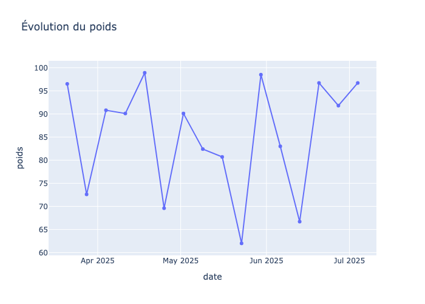
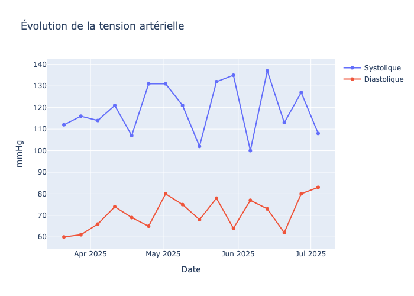
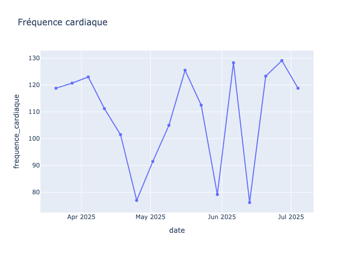
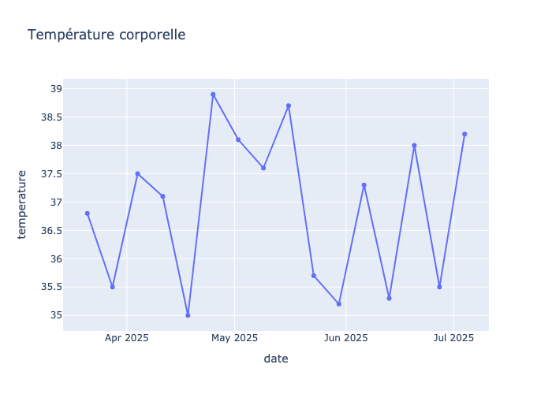

**Contexte clinique résumé :**  
Monsieur Alain Deloin présente une douleur du flanc gauche irradiant vers le pubis, des urines troubles avec hématurie macroscopique, dans un contexte de polypathologie, anticoagulation, dénutrition, troubles cognitifs et retour récent d’hospitalisation.

---

## 1. Prévention

- **Alerte immédiate au médecin traitant** pour suspicion d’infection urinaire compliquée ou de colique néphrétique, situation à risque de décompensation chez la personne âgée fragile (Fiche RBPP 29 — Repérage des risques de perte d’autonomie, HAS/ANESM).
- **Coordination avec l’équipe de soins à domicile** (IDE, SAAD, SSIAD) pour surveillance rapprochée et transmission des observations (Fiche RBPP 104 — Organisation d’un retour à domicile après hospitalisation).
- **Prévention des complications** : maintien d’une hydratation adaptée si absence de contre-indication, surveillance de l’état général et de la douleur (Fiche RBPP 31 — Prise en charge des personnes âgées fragiles en ambulatoire).

---

## 2. Traitements / Prise en charge immédiate

- **Prélèvements à réaliser sans délai** (sur prescription médicale) :
  - ECBU (examen cytobactériologique des urines) pour recherche d’infection urinaire.
  - Bilan sanguin si possible (NFS, créatininémie, CRP, ionogramme, bilan de coagulation en raison de l’anticoagulation).
- **Antalgiques de palier 1** (paracétamol) en première intention, en respectant les posologies adaptées à l’âge et à la fonction rénale (Intergroupe douleur SFGG/SFETD, HAS 2020-2022).
- **Surveillance de la diurèse** et des apports hydriques.
- **Alerte à l’équipe médicale** pour évaluation rapide et adaptation du traitement selon l’évolution et les résultats des examens.
- **Ne pas introduire d’antibiothérapie sans confirmation microbiologique**, sauf aggravation clinique ou impossibilité de réaliser l’ECBU rapidement (HAS, prise en charge des personnes âgées polypathologiques en soins primaires).

---

## 3. Surveillance / Suivi

- **Surveillance rapprochée à domicile** par l’infirmière :
  - Température, fréquence et intensité de la douleur (EVA), aspect des urines, état général (conscience, confusion, signes de déshydratation, aggravation des troubles cognitifs).
  - Surveillance de la tolérance des antalgiques et du risque de surdosage (Intergroupe douleur SFGG/SFETD).
  - Surveillance de l’apparition de signes de gravité (voir ci-dessous).
- **Transmission systématique** de toute modification à l’équipe médicale et traçabilité dans le dossier de soins (Fiche RBPP 29 et 104).
- **Réévaluation médicale rapide** (sous 24-48h ou plus tôt selon évolution) (Fiche RBPP 104).

---

## 4. Alerte / Urgences

**Signes d’alerte à surveiller et à signaler sans délai au médecin ou au SAMU :**
- Fièvre > 38°C ou frissons.
- Douleur intense non soulagée par le paracétamol.
- Aggravation de l’état général : confusion, agitation, somnolence, chute de la tension artérielle.
- Anurie ou diminution marquée de la diurèse.
- Hématurie abondante ou caillots dans les urines.
- Signes de choc (pâleur, sueurs, tachycardie, hypotension).
- Saignement anormal (en raison de l’anticoagulation).

**Sources utilisées :**
- Fiche RBPP 29 — Repérage des risques de perte d’autonomie ou de son aggravation (HAS/ANESM).
- Fiche RBPP 104 — Organisation d’un retour à domicile après hospitalisation.
- Fiche RBPP 31 — Prise en charge des personnes âgées fragiles en ambulatoire.
- Intergroupe douleur SFGG/SFETD, HAS 2020-2022.
- HAS — Prendre en charge une personne âgée polypathologique en soins primaires.

---

**Remarque :**  
La conduite à tenir doit être adaptée en fonction de l’évolution clinique et des résultats des examens complémentaires. Toute aggravation impose une réévaluation médicale urgente.

## Graphique des constantes du patient

